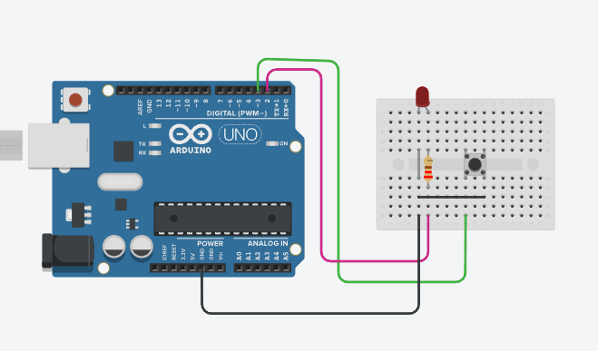
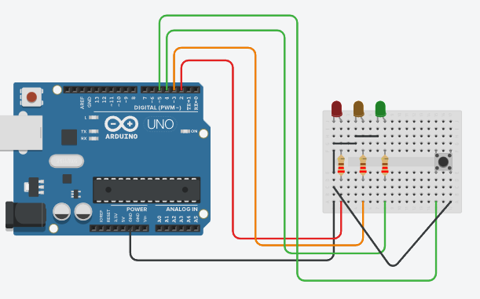

# cpp-arduino
# Projets Arduino LED 🚨

## Description
Collection de projets Arduino pour le contrôle des LED avec différentes fonctionnalités.

## 🔌 Projet 1: Contrôleur LED


Système simple permettant de contrôler une LED avec 3 modes différents via un bouton-poussoir.

### Composants
- Arduino Uno
- 1 LED
- 1 Bouton poussoir
- 1 Résistance 220Ω
- Fils de connexion

### Fonctionnalités
- Mode 1: LED éteinte
- Mode 2: LED clignotante (1 seconde)
- Mode 3: LED allumée

## 🏖️ Projet 2: Système d'Alerte


Système d'alerte avec 3 LED de couleur et fonction SOS.

### Composants
- Arduino Uno
- 3 LED (Rouge, Orange, Verte)
- 1 Bouton SOS
- 3 Résistances 220Ω
- Fils de connexion

### Commandes Série
| Commande | LED | Signification |
|----------|-----|---------------|
| meduse   | 🔴  | Danger méduses|
| tempete  | 🔴  | Tempête      |
| requin   | 🔴  | Danger requin |
| vague    | 🟡  | Vagues fortes |
| calme    | 🟢  | Conditions OK |

## ⚙️ Installation
1. Clonez le dépôt
```bash
git clone [https://github.com/ehsansepar/cpp-arduino.git]
```

2. Ouvrez le fichier `.cpp` souhaité dans l'IDE Arduino
3. Téléversez le code vers votre carte en `.ino`

## 📸 Images
Pour ajouter vos photos:
1. Créez un dossier `images/`
2. Ajoutez vos photos
3. Utilisez le chemin relatif: `images/`

## 🤝 Contribution
Les contributions sont bienvenues:
1. Fork le projet
2. Créez une branche (`git checkout -b feature/AmazingFeature`)
3. Commit (`git commit -m 'Add AmazingFeature'`)
4. Push (`git push origin feature/AmazingFeature`)
5. Ouvrez une Pull Request

## 📝 License
Distribué sous la licence MIT. Voir `LICENSE` pour plus d'informations.

## 📫 Contact
Votre Nom - Ehsan
Email     - ehsan.separ007@gmail.com

Lien du projet: [https://github.com/ehsansepar/arduino](https://github.com/ehsansepar/cpp-arduino)
